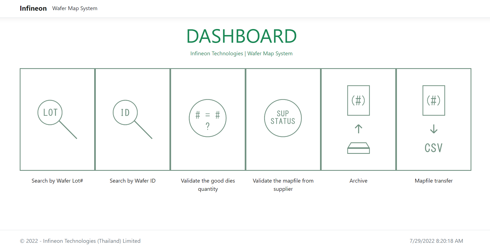
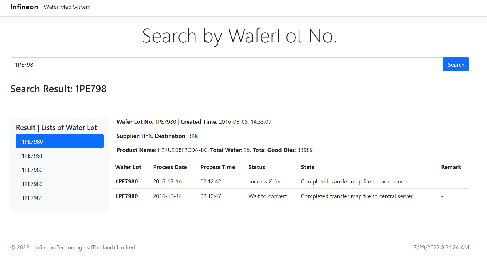
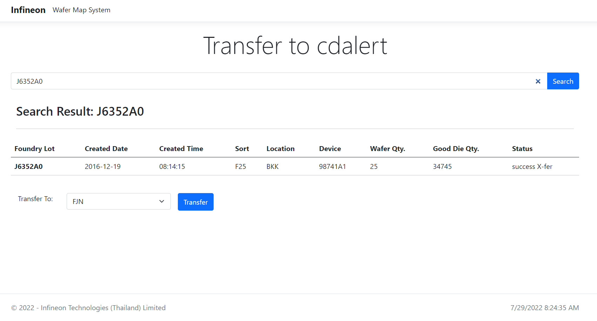
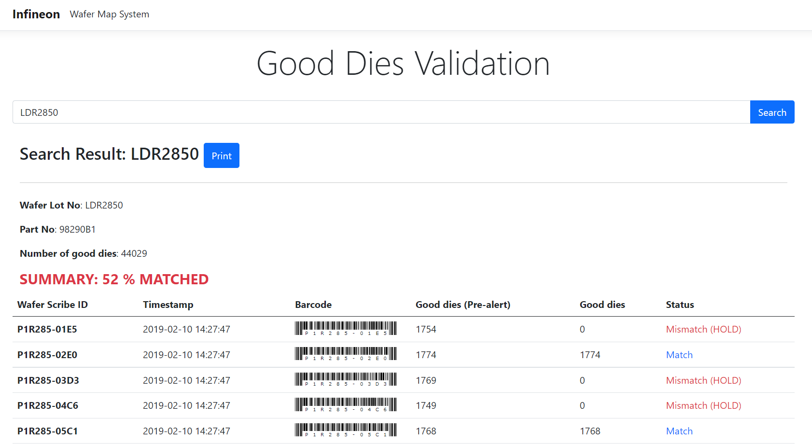

# Wafermap-System
BKK Wafer Map System is the project from Infineon's summer internship program.

## Authors
Tunwa Satianrapapong 

Ruihua Lu

## Preview

## Features

- [x] Homepage (Index page + Dashboard)
- [x] Search the wafer lot information by using the wafer lot number
- [x] Search the wafer lot information by using the wafer scribe id
- [x] Validate the mapfile from supplier server
- [x] Validate the number of good dies
- [x] Generate and transfer .csv file to cdalert local server
- [x] Check the archive mapfile that was stored in archive folder when the time passed